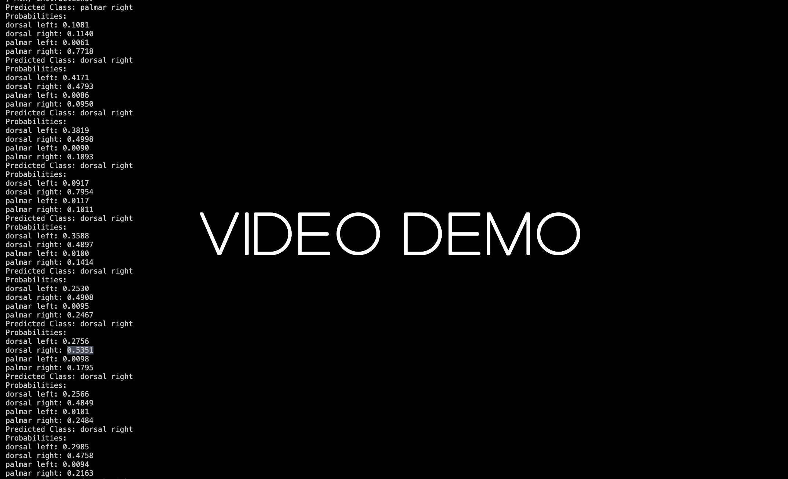
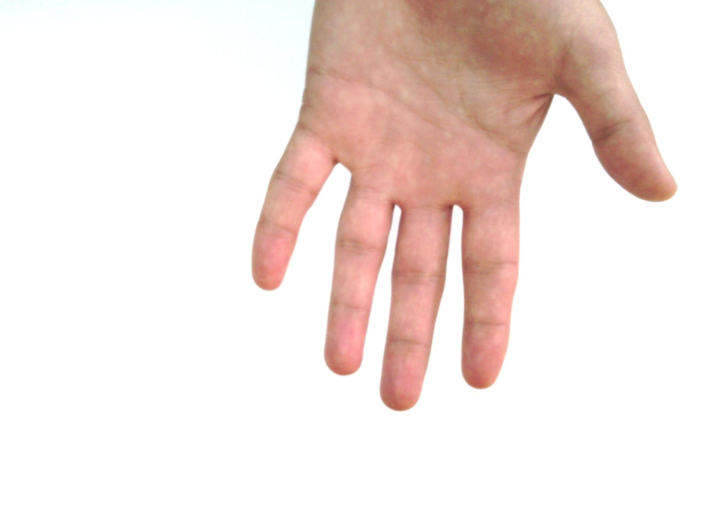
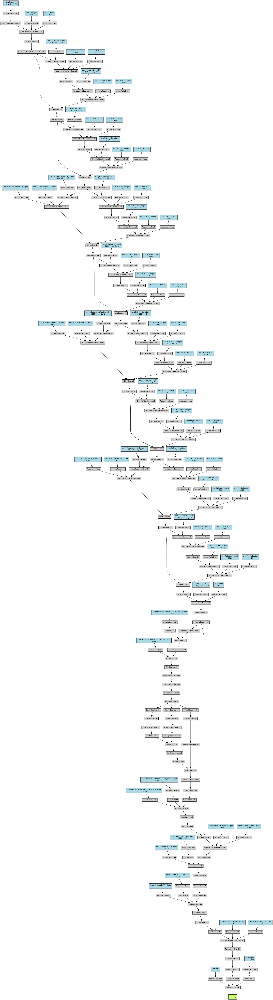

# Few-Shot Hand Classification Model for Gesture Control

**An implementation of a Hand Gesture Recognition Algorithm that uses a webcam feed to control music playback on a macOS system, leveraging a HybridResNetTransformer model for feature extraction and classification. The model is designed to support few-shot learning, enabling users to self-calibrate the model with a small number of hand gesture samples for personalized control.**

---

**Technical Topics:** *Computer Vision, Convolutional Neural Networks (CNNs), Transformers, Few-Shot Learning*

**Tools / Technologies:** *Python, PyTorch, OpenCV, Pandas, NumPy, Osascript, PIL*

**Use Case:** *Provides assistance to individuals with fine-motor control challenges or other disabilities, helping them navigate their devices more easily*

---
### Performance:

Model performance based on evaluation script:

```Accuracy: 0.95```
```Precision: 0.95```
```Recall: 0.94```
```F1-Score: 0.94```
```
Confusion Matrix:

            Predicted
            -------------
            |  P  |  N  |
        ---------------------
Actual   P  |  10 |  1  |  <-- True Positives (TP) = 10, False Negatives (FN) = 1
        ---------------------
         N  |   1 |  11 |  <-- False Positives (FP) = 1, True Negatives (TN) = 11

```

### Demo:

Below is a video demonstration of the model being used to play/pause music on my MacBook.

<a href="https://www.youtube.com/watch?v=LX3dHq0LZNk">
    
</a>

---

### Technical Explanation:

#### Preprocessing -- [preprocessing.py](https://github.com/harshp30/FewShotHandClassificationGestureController/blob/main/src/preprocessing.py)

The preprocessing script takes the full dataset and undersamples it such that for the training split, each class has 20 images. This sets up the data for a 20-shot model training procedure. This script also splits the data into train, validation, and test splits with each image having a corresponding label contained in a one-hot encoded .txt file as shown below.

```
class_mapping = {
    0: 'dorsal left',
    1: 'dorsal right',
    2: 'palmar left',
    3: 'palmar right'
}
```

Label: `Hand_0000980.jpg 2`

Image: 

<a>
    
</a>

---

#### Training Loop -- [train.py](https://github.com/harshp30/FewShotHandClassificationGestureController/blob/main/src/train.py)

The training script handles the process of training the `HybridResNetTransformer` model. It includes defining the loss function, initializing the optimizer, loading the data, and running the training and validation loops.

1. **Hyperparameters**
   - `batch_size`: Specifies the number of samples per batch.
   - `learning_rate`: Defines the learning rate for the optimizer.
   - `num_epochs`: Sets the number of training epochs.
   - `patience`: Determines the number of epochs to wait for improvement before early stopping.

2. **Data Preparation**
   - **CustomDataset**: A class to load and preprocess images and labels.
   - **DataLoader**: Utilized to load the data in batches for training and validation.
   - **Data Transforms**: Includes resizing and converting images to tensors.

3. **Model Initialization**
   - **HybridResNetTransformer**: The custom model that combines ResNet and Transformer architectures.
   - The number of classes is determined from the training dataset.
   - The model is moved to the GPU if available.

4. **Optimizer**
   - **Adam**: The optimizer used to update model parameters.

5. **Early Stopping Parameters**
   - Keeps track of the best validation loss and stops training if no improvement is seen for a specified number of epochs.

6. **Training Loop**
   - Iterates over the number of epochs.
   - For each epoch:
     - Sets the model to training mode.
     - Iterates over training batches, performs forward pass, computes loss, backpropagates, and updates weights.
     - Computes the average training loss for the epoch.
     - Validates the model on the validation set and computes the average validation loss.
     - Prints training and validation loss.
     - Saves the model if the validation loss improves.
     - Implements early stopping based on validation loss.

7. **Validation Function**
   - Evaluates the model on the validation set.
   - Computes the average validation loss.

8. **Main Block**
   - Defines the loss function.
   - Calls the `train_model` function to start training.

By following this structure, the training script ensures effective training, validation, and model saving procedures, leveraging early stopping to avoid overfitting.

---

#### Model Architecture -- [model.py](https://github.com/harshp30/FewShotHandClassificationGestureController/blob/main/src/model.py)

The model script defines the architecture for the `HybridResNetTransformer` model, which is designed to support a low-shot approach for hand gesture recognition. This hybrid model combines the feature extraction capabilities of ResNet with the long-range dependency modeling of transformers.

1. **Imports**
   - `torch`, `torch.nn`, `torch.nn.functional`, `models`: Necessary libraries for building the neural network, including PyTorch and pre-trained models from torchvision.

2. **TransformerBlock Class**
   - **Initialization**
     - `embed_dim`: Dimensionality of the embedding space.
     - `num_heads`: Number of attention heads.
     - `ff_dim`: Dimensionality of the feed-forward network.
     - `dropout`: Dropout rate.
   - **Layers**
     - `attention`: Multi-head attention layer for capturing dependencies across different parts of the input sequence.
     - `norm1`, `norm2`: Layer normalization layers to stabilize and speed up training.
     - `ff`: Feed-forward network consisting of two linear layers with a ReLU activation in between.
     - `dropout`: Dropout layer for regularization to prevent overfitting.
   - **Forward Pass**
     - Applies multi-head attention followed by dropout and layer normalization.
     - Passes the output through the feed-forward network followed by another round of dropout and layer normalization.

3. **HybridResNetTransformer Class**
   - **Initialization**
     - `num_classes`: Number of output classes.
     - `num_transformer_layers`: Number of Transformer layers.
     - `embed_dim`: Dimensionality of the embedding space.
     - `num_heads`: Number of attention heads.
     - `ff_dim`: Dimensionality of the feed-forward network.
   - **Layers**
     - **ResNet Backbone**: Loads a pre-trained ResNet18 model and removes the last two layers (average pooling and fully connected layer) to use it as a feature extractor.
     - **1x1 Convolution**: A convolutional layer to adjust the channel dimension to match the embedding dimension expected by the Transformer.
     - **Transformer Blocks**: Stacks multiple Transformer blocks to capture long-range dependencies.
     - **Adaptive Pooling**: Applies adaptive average pooling to reduce the spatial dimensions to 1x1, making the feature maps compatible for the fully connected layer.
     - **Fully Connected Layer**: Maps the embeddings to the number of output classes for classification.
   - **Forward Pass**
     - Passes input through the ResNet18 model to extract spatial features.
     - Applies a 1x1 convolution to adjust the channel dimension.
     - Reshapes and permutes the tensor to match the input shape required by the Transformer (sequence length, batch size, embedding dimension).
     - Passes the tensor through the stacked Transformer blocks.
     - Reshapes and permutes back to the original format.
     - Applies adaptive average pooling and flattens the tensor.
     - Passes the tensor through the fully connected layer for classification.

4. **Main Block**
   - Creates an instance of the `HybridResNetTransformer` model.
   - Prints the model architecture to verify its structure.

By combining the convolutional capabilities of ResNet with the sequence modeling strengths of transformers, this architecture is well-suited for tasks that require both spatial feature extraction and long-range dependency modeling. This makes it particularly effective for hand gesture recognition in a low-shot learning scenario.

*Model Diagram*

Below is a model architecture diagram made using torchviz.

<a>
    
</a>

---

#### Evaluation -- [eval.py](https://github.com/harshp30/FewShotHandClassificationGestureController/blob/main/src/eval.py)

The evaluation script handles the process of evaluating the `HybridCNNTransformer` model on the test dataset. It includes loading the data, defining the data transforms, initializing the model, and computing the test accuracy.

1. **Imports**
   - `torch`, `torch.nn`, `DataLoader`, `Dataset`, `transforms`: Essential libraries for loading the dataset, defining the transformations, and evaluating the model.
   - `Image`: Used to load images.
   - `HybridCNNTransformer`: The custom model class that combines CNN and Transformer architectures.

2. **Custom Dataset Class**
   - **Initialization**
     - `image_dir`: Directory containing the images.
     - `labels_path`: Path to the labels file.
     - `transforms`: Optional transforms to apply to the images.
   - **Methods**
     - `__len__`: Returns the total number of samples in the dataset.
     - `__getitem__`: Retrieves a sample from the dataset. It reads the image and corresponding label, applies the transforms, and returns them.

3. **Hyperparameters**
   - `batch_size`: Specifies the number of samples per batch.
   - `device`: Sets the device to GPU if available, otherwise CPU.

4. **Paths**
   - `test_image_dir`: Directory containing test images.
   - `test_labels_path`: Path to the test labels file.
   - `model_save_path`: Path to the saved model file.

5. **Data Preparation**
   - **Data Transforms**: Resizing the images to 224x224 and converting them to tensors.
   - **Dataset and DataLoader**: Creating the dataset and dataloader for testing.

6. **Model Initialization**
   - **HybridCNNTransformer**: Initializes the custom model with the number of classes.
   - Loads the trained model parameters and sets the model to evaluation mode.

7. **Evaluation Function**
   - **evaluate_model**
     - Iterates over the test data.
     - For each batch, moves the images and labels to the specified device.
     - Computes the outputs of the model.
     - Determines the predicted class by finding the class with the highest score.
     - Computes the total number of correct predictions and calculates the accuracy.

8. **Main Block**
   - Calls the `evaluate_model` function and prints the test accuracy.

By following this structure, the evaluation script ensures that the model's performance is accurately measured on the test dataset.

---

#### Controller -- [controller.py](https://github.com/harshp30/FewShotHandClassificationGestureController/blob/main/src/controller.py)

The inference script captures live video from a webcam, performs hand gesture classification using the `HybridResNetTransformer` model, and controls music playback on a macOS system based on the predicted gesture.

1. **Imports**
   - `torch`, `torch.nn`, `transforms`: Essential libraries for model inference and image preprocessing.
   - `cv2`: OpenCV for capturing live video from the webcam.
   - `Image`: Used to load and process images.
   - `time`, `os`: Used for timekeeping and system commands.
   - `HybridResNetTransformer`: The custom model class that combines ResNet and Transformer architectures.

2. **Paths**
   - `model_save_path`: Path to the saved model file.
   - `device`: Sets the device to GPU if available, otherwise CPU.

3. **Class Mapping**
   - Maps the class indices to their corresponding gesture names.

4. **Data Transforms**
   - Resizes the images to 224x224 and converts them to tensors.

5. **Model Initialization**
   - Initializes the `HybridResNetTransformer` model with the number of classes.
   - Loads the trained model parameters and sets the model to evaluation mode.

6. **Predict Image Function**
   - **predict_image**
     - Loads and preprocesses an image.
     - Performs inference using the trained model.
     - Applies softmax to obtain class probabilities.
     - Returns the predicted class index and probabilities for each class.

7. **Music Control Functions**
   - **play_music**: Uses AppleScript to play music on macOS.
   - **pause_music**: Uses AppleScript to pause music on macOS.

8. **Video Capture Initialization**
   - Initializes the webcam for capturing live video.

9. **Main Loop**
   - Continuously captures frames from the webcam.
   - Displays the live video feed.
   - Every 3 seconds, captures a frame, saves it, and performs prediction.
   - Displays the predicted class and probabilities.
   - Controls music playback based on the predicted class and a probability threshold.
   - Allows the user to exit the video feed by pressing 'q'.

By following this structure, the inference script provides a seamless way to control music playback based on real-time hand gesture recognition.

---

### Next Steps:

- Expand the project to have a built-in data capture process so individuals can input photos of their hands and take advantage of the few-shot model architecture.

---

### Citations:

Dataset Credit:

```
@article{afifi201911kHands,

  title = {11K Hands: gender recognition and biometric identification using a large dataset of hand images},

  author = {Afifi, Mahmoud},

  journal = {Multimedia Tools and Applications},

  doi = {10.1007/s11042-019-7424-8},

  url = {https://doi.org/10.1007/s11042-019-7424-8},

  year={2019}

}
```
